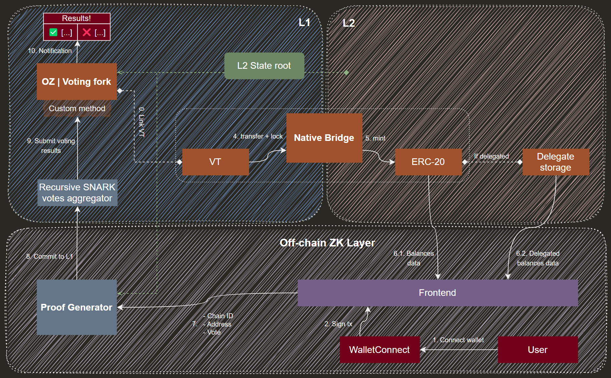

# Installation

## Frontend module
1.
2.
3.

## Backend module
1. `npm install`
2. `docker-compose up` - run Redis in Docker
3. `npm start` - run server

## On-chain module
1.
2.
3.

## ZK Proof generator
1.
2.
3.

# Deployments

## Twitter

- [Gnosis Twitter Announce](https://twitter.com/Hilaymanai/status/1726068600484598095)

## Contract addresses

### Sepolia
- VotesTokenL1 - [0x4d389dA3786036ee0b9aba8E4B99891a925d88D0](https://sepolia.etherscan.io/address/0x4d389dA3786036ee0b9aba8E4B99891a925d88D0)
- GovernerL1 - [0xD7A1DC78F0E90Ab2645E1DbECf6135D17c7dA411](https://sepolia.etherscan.io/address/0xD7A1DC78F0E90Ab2645E1DbECf6135D17c7dA411)
- StateRootL1 - [0xbb8c8E79c34C6420716A6937bF7E3B9226Cc81f5](https://sepolia.etherscan.io/address/0xbb8c8E79c34C6420716A6937bF7E3B9226Cc81f5)

### Scroll-sepolia
- TokenL2 - [0xC007267DF5f0f7aEc5fb90CF03b56F051Bc6C89e](https://sepolia-blockscout.scroll.io/address/0xC007267DF5f0f7aEc5fb90CF03b56F051Bc6C89e)
- DelegateL2 - [0x4d389dA3786036ee0b9aba8E4B99891a925d88D0](https://sepolia-blockscout.scroll.io/address/0x4d389dA3786036ee0b9aba8E4B99891a925d88D0)

### XDC-testnet
- TokenL2 - [0xbb8c8E79c34C6420716A6937bF7E3B9226Cc81f5](https://explorer.apothem.network/address/0xbb8c8E79c34C6420716A6937bF7E3B9226Cc81f5#transactions)
- DelegateL2 - [0x491A7D1A203980Fd5d2cdE093893FcdCf994291e](https://explorer.apothem.network/address/0x491A7D1A203980Fd5d2cdE093893FcdCf994291e#internalTransactions)

### Arbitrum-sepolia
- TokenL2 - [0xC007267DF5f0f7aEc5fb90CF03b56F051Bc6C89e](https://sepolia.arbiscan.io/address/0xc007267df5f0f7aec5fb90cf03b56f051bc6c89e)
- DelegateL2 - [0x4d389dA3786036ee0b9aba8E4B99891a925d88D0](https://sepolia.arbiscan.io/address/0x4d389dA3786036ee0b9aba8E4B99891a925d88D0)

### Polygon-zkEVM-testnet
- TokenL2 - [0xC007267DF5f0f7aEc5fb90CF03b56F051Bc6C89e](https://testnet-zkevm.polygonscan.com/address/0xc007267df5f0f7aec5fb90cf03b56f051bc6c89e)
- DelegateL2 - [0x4d389dA3786036ee0b9aba8E4B99891a925d88D0](https://testnet-zkevm.polygonscan.com/address/0x4d389dA3786036ee0b9aba8E4B99891a925d88D0)

### Gnosis-mainnet
- TokenL2 - [0xbb8c8E79c34C6420716A6937bF7E3B9226Cc81f5](https://gnosisscan.io/address/0xbb8c8E79c34C6420716A6937bF7E3B9226Cc81f5)
- DelegateL2 - [0x491A7D1A203980Fd5d2cdE093893FcdCf994291e](https://gnosisscan.io/address/0x491A7D1A203980Fd5d2cdE093893FcdCf994291e)

### Celo-alfajores
- TokenL2 - [0xC007267DF5f0f7aEc5fb90CF03b56F051Bc6C89e](https://alfajores.celoscan.io/address/0xC007267DF5f0f7aEc5fb90CF03b56F051Bc6C89e)
- DelegateL2 - [0x4d389dA3786036ee0b9aba8E4B99891a925d88D0](https://alfajores.celoscan.io/address/0x4d389dA3786036ee0b9aba8E4B99891a925d88D0)

### Base-goerli
- TokenL2 - [0x6c9373BaD4d213Ea0C796cCF039102B43341df24](https://goerli.basescan.org/address/0x6c9373bad4d213ea0c796ccf039102b43341df24)
- DelegateL2 - [0x507d16b08562Bc341775657C18eA2123EFc69FD1](https://goerli.basescan.org/address/0x507d16b08562Bc341775657C18eA2123EFc69FD1)

### Linea-testnet
- TokenL2 - [0xC007267DF5f0f7aEc5fb90CF03b56F051Bc6C89e](https://goerli.lineascan.build/address/0xc007267df5f0f7aec5fb90cf03b56f051bc6c89e)
- DelegateL2 - [0x4d389dA3786036ee0b9aba8E4B99891a925d88D0](https://goerli.lineascan.build/address/0x4d389da3786036ee0b9aba8e4b99891a925d88d0)

# Introduction

## Problem

- For voting in DAO protocols, voting tokens (VTs) are required.

- What happens if VTs are scattered across multiple networks simultaneously?

- **Two problems arise:**
    1. The complexity of **synchronizing** voting results from multiple networks concurrently.
    2. The inability to deploy VTs in other networks due to **bridge architecture limitations** (converting VTs into ERC20 tokens).

## Examples

- Uniswap V3 | `UNI` token | OpenZeppelin Governor + Snapshot
- Lido V2 | `LDO` token | Aragon
- Curve | `CRV` token | Aragon
- ENS | `ENS` token | Snapshot + Tally
- Balancer | `BAL` token | Snapshot
- … and any other protocols with a VTs in L1 that lack implementations in L2.

## Solution

**A crosschain governance protocol that:**

1. Uses a **trustless & universal** architecture supporting multiple L2 networks, with VT on L1.

2. Uses **default ERC-20** to eliminate conflicts in the bridge architecture.

3. Shifts the execution of L2-voting mechanisms to the **ZKP-module**, instead of using VT.

4. Implements ZKP to validate the accurate delivery of **L2 State data**.

## Architecture

**Step 1.** VT → Bridge → ERC-20

**Step 2.** We use standard ERC-20 (or delegate storage), aggregate information about balances recorded in the snapshot, and send it to the Frontend for further use.

**Step 3.** Through the Frontend, the Proof Generator receives information about `ChainId`, `Voter Address`, and `Vote`; based on these values, the Proving System generates a SNARK proof and commits it to the votes aggregator on L1.

**Step 4.** The main Voting Contract accounts for votes from all networks, incorporates them into the quorum, and distributes them across the proposal options. Voting is finished.

# Demonstration

## Workflow demo

# Configuration

## Programming languages

1.

## Libraries

1.

## Frameworks

1.

# Future track

1. Improving SNARK proofs aggregation.

2. Implementing custom plugins for voting mechanisms:
    - OpenZeppelin Governor | Ethereum | [link](https://docs.openzeppelin.com/contracts/4.x/api/governance)
    - Aragon | Ethereum | [link](https://aragon.org/)
    - Tally | Ethereum | [link](https://www.tally.xyz/)
    - Guild | Ethereum | [link](https://guild.xyz/)
    - Llama | Ethereum | [link](https://llama.xyz/)
    - Colony | Ethereum | [link](https://colony.io/)
    - Snapshot | Ethereum | [link](https://snapshot.org/#/)